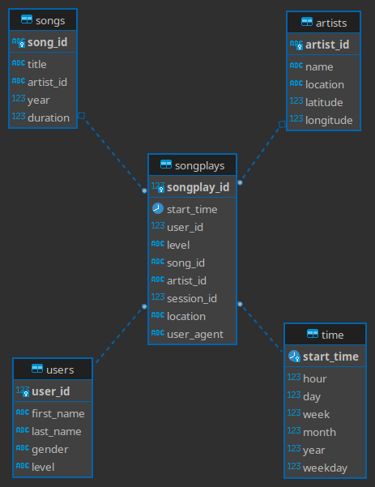

# Sparkifydb ETL

An ETL pipeline and database for Sparkify's listener data.

# Introduction

* The current project presents a database and ETL pipeline that captures user song listening activity for Sparkify, enabling effortless queries of the company's data.
* After processing data through the ETL pipeline, SQL queries can be run against the PostgreSQL database to extract actionable information.

# Technologies

* Python 3.6
    * pandas
    * psycopg2
* PostgreSQL

# Setup

## 1. Python
After cloning the git repository, it is recommended that you create a [virtual environment](https://virtualenvwrapper.readthedocs.io/en/latest/) and install the Python dependencies with pip:
`pip install -r requirements.txt`

## 2. PostgreSQL
This project requires a running PostgreSQL instance. The hostname/port and user credentials can be specified in the relevant `psycopg2` connection sections in `create_tables.py` and `etl.py`.

e.g. `conn = psycopg2.connect("host=<postgres host IP> dbname=<database name> user=<username> password=<user password>")`

## 3. Data files

The ETL code expects log and song data to be present in a `data` directory with the following structure:

```bash
data/
├── log_data
[JSON log files]
└── song_data
[JSON song files]
```

The song and artist data files are expected to have the following structure:

```json
{
  "artist_id": ...,
  "artist_latitude": ...,
  "artist_location": ...,
  "artist_longitude": ...,
  "artist_name": ...,
  "duration": ...,
  "num_songs": ...,
  "song_id": ...,
  "title": ...,
  "year": ...
}
```

The log data files are expected to have the following structure:

```json
{
  "artist": ...,
  "auth": ...,
  "firstName": ...,
  "gender": ...,
  "itemInSession": ...,
  "lastName": ...,
  "length": ...,
  "level": ...,
  "location": ...,
  "method": ...,
  "page": ...,
  "registration": ...,
  "sessionId": ...,
  "song": ...,
  "status": ...,
  "ts": ...,
  "userAgent": ...,
  "userId": ...
}
```

# Usage

There are two Python scripts that must be run in the following order to provision the database:

1. `create_tables.py`: This will 
      - create or connect to an existing instance of the "sparkifydb" database, 
      - drop existing database tables,
      - and create all of the database tables specified in `sql_queries.py`.
2. `etl.py`: This will perform the ETL process and populate the database with the song and log data files.

# Files in the repository

The following files and directories are present in the project repository:

* `data/` - This directory holds example `log_data` and `song_data` which can be loaded into the database.
* `create_tables.py` - This script creates or connects to a database instance, drops existing tables, and creates all of the database tables according to the schema.
* `etl.ipynb` - This is a Jupyter notebook for testing the ETL process.
* `etl.py` - This is the file that performs the ETL process, including processing song and log data.
* `README.md` - This file.
* `sql_queries.py` - This file contains a collection of SQL queries to create tables, insert data into tables, and query the songs table.
* `test.ipynb` - This Jupyter notebook contains a number of tests to evaluate the ETL process and the database schema.
* `requirements.txt` - Python dependencies


# Database schema design and ETL pipeline

## Schema



The database follows a "star" schema (see image above), in which a central fact table – `songplays` – is qualified by the following dimension tables: 

- `users`,
- `songs`,
- `artists` and
- `time` (containing expanded timestamp data).

These are populated during the ETL process from songs and user logs datasets. The benefit of this design is that it minimises the number of SQL JOINS that must be performed to query the database. Note that `artist_id` is duplicated in the `songs`, `artists`, and `songplays` table (this allows a `JOIN` between `songs` and `artists` during the ETL process outlined below).

## ETL process

The ETL process for reading these data files and populating the database proceeds as follows.

### For each song data file:

1. parse file contents to Pandas DataFrame
2. extract the following fields from the single record in the file, and insert a row in the `songs` table:
    - `song_id`
    - `title`
    - `artist_id`
    - `year`
    - `duration`
3. extract the following fields from the single record in the file, and insert a row in the `artists` table:
    - `artist_id`
    - `artist_name`
    - `artist_location`
    - `artist_latitude`
    - `artist_longitude`

### For each log file:
Note: the data in the fact table `songplays` is derived from both the songs and logs data sets.

1. parse file contents to Pandas DataFrame
2. filter entries to only include those with the `NextSong` `page` action.
3. convert the timestamp (`ts`) column to Pandas timestamp format
4. populate the `time` table with the following values derived from the Pandas timestamp (`ts`):
    - `time_stamp`
    - `hour`
    - `day`
    - `week`
    - `month`
    - `year`
    - `weekday`
5. populate the `users` table with the following data values:
    - `userId`
    - `firstName`
    - `lastName`
    - `gender`
    - `level`
6. Finally, we create an entry in the `songplays` table by:
    - retrieving the associated `song_id` and `artist_id` from the `songs` and `artists` table using the `song`, `artist` , and `length` values of the current log entry, and
    - inserting the following values into the `songplays` table:
        - `ts`
        - `userId`
        - `level`
        - `songid`
        - `artistid`
        - `sessionId`
        - `location`
        - `userAgent`


